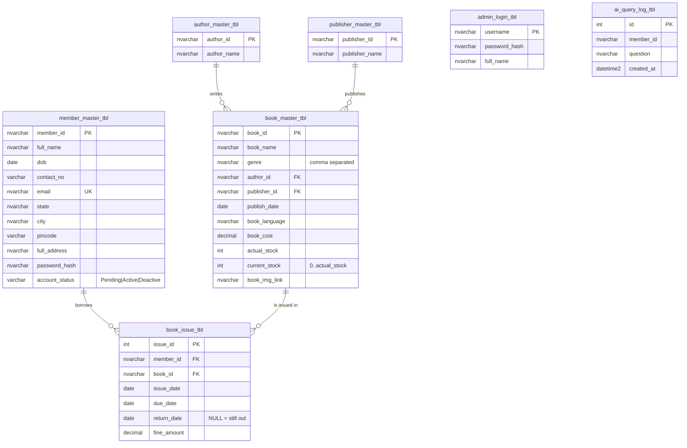

# Database design – `ElibraryDB` (SQL Server)

| Object | Purpose |
|---|---|
| `vw_book_catalog` | Book + author + publisher in one row; used by the grids and the AI Librarian |
| `vw_issued_books` | Issue history with a computed status (Issued / Overdue / Returned) |
| `sp_IssueBook` | Transactional issue: member must be Active, stock > 0, max 5 open loans, max 30 days |
| `sp_ReturnBook` | Transactional return: restores stock, fine = Rs 5 per late day |
| `ux_active_issue` | Unique filtered index: one open loan per member per book |

**Connection:** the app reads the single connection string named `con` in `Web.config`. Change `Data Source` to your instance
(`.\SQLEXPRESS`, `(localdb)\MSSQLLocalDB`, or `localhost`). Only parameterized queries / stored procedures touch the database (`Infrastructure/Db.cs`).
